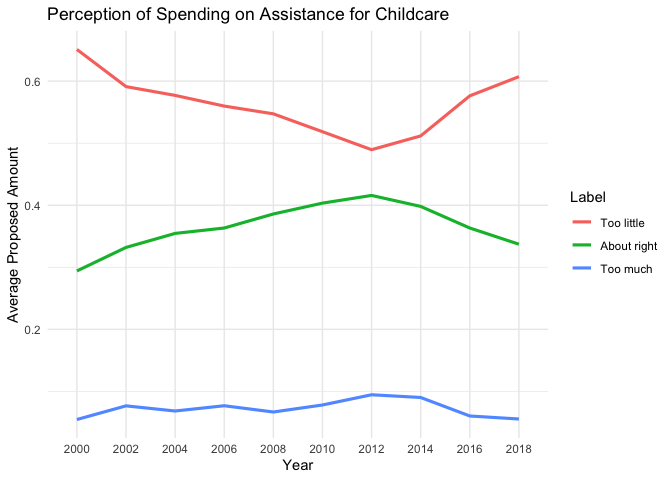

Youth Risk Behavior Analysis
================
Juan Ramirez

## Youth Risk Behavior Surveillance Systems (YRBSS)

This data is from a survey given every other year called the Youth Risk
Behavior Surveillance System administered by the Center for Disease
Control and Prevention. The survey monitors health risks among youth,
such as violence, sexually transmitted diseases, tobacco, and alcohol
use.

The dataset contains over 100,000 rows from 2003 to 2015. A codebook is
also provided that gives extensive information on the survey. The data
can be stored in an Excel or spreadsheet program, but it cannot be
manipulated in those programs because of its size - this why we need R.

### Importing the Data

Let’s read in the data. The data use “NA” as the missing data option -
fix the code to recognize this by replacing the \_\_\_\_\_\_\_. After
you load the data, notice the messages and warnings provided:

``` r
youth <- read_csv("data/YRBS2015.csv", na = "NA")
#you can click the X on the output in the right-hand corner to get rid of the output once you've looked at it
#spec(youth) let's you look at all defaults
```

You can look at some of the problems with this code:

``` r
problems(youth)
```

We won’t clean all of the columns, but just a few specific ones.

For example, here are the `distinct` values in the Age Category

``` r
youth %>% 
  distinct(AgeCat)
```

and for the Grade

``` r
youth %>% 
  distinct(Grade)
```

We want to strip out just the numbers for these two variables. Other
variables for some reason are being treated as “logical” types
(TRUE/FALSE). The other columns not listed we want to skip

``` r
youth <- read_csv("data/YRBS2015.csv", na = "NA",
                  col_types = cols(
                    .default = col_skip(),  #set default to skip any columns we don't specify
                    Year = col_double(),
                    `Analysis weight` = col_double(),
                    `Record ID` = col_double(),
                    AgeCat = col_number(),  #make a number to remove "years old"
                    Gender = col_character(),
                    Grade = col_number(),  #make a number to remove 'th grade
                    Race4 = col_character(),
                    `Height in meters` = col_double(),
                    `Weight in kilograms` = col_double(),
                    `Body Mass Index` = col_double(),
                    `BMI percentile` = col_double(),
                    `Perception of weight` = col_character(),
                    `Weight loss` = col_character(),
                    `Fruit eating` = col_character(),
                    `Salad eating` = col_character(),
                    `Other vegetable eating` = col_character(),
                    `Soda drinking` = col_character(), #make character
                    `How many glass of milk 7 days` = col_character(),
                    `Breakfast eating` = col_character(), #make character
                    `Physical activity >= 5 days` = col_character(), #make character
                    `Television watching` = col_character(),
                    `Computer use` = col_character(),
                    `Sports team participation` = col_character(),
                    Asthma = col_character(),
                    `Hours of sleep on school night` = col_character(),
                    `Grades in school` = col_character(),
                    `Difficulty concentrating` = col_character() 
                  ))

spec(youth)
```

Let’s try to clean up our variable names using `janitor`

``` r
youth <- janitor::clean_names(youth)
```

Now, let’s take a new look at the data, notice we are focusing on the
variables related to nutrition and health:

``` r
glimpse(youth)
```

Now that the data is clean(ish), we can write the data to a new csv
file:

``` r
youth %>% 
  write_csv("data/yrbs_health_only.csv")
```

Now that we have our clean data saved, we will not want to run the above
code again and again, add in the command `eval = FALSE` to the all code
chunks above so they do not run when you knit the document.

### Pivoting the Data Wider

First, let’s read in our new data

``` r
new_youth <- read_csv("data/yrbs_health_only.csv",
                      col_types = cols(
                        soda_drinking = col_character(),
                        breakfast_eating = col_character(),
                        physical_activity_5_days = col_character(),
                        hours_of_sleep_on_school_night = col_character(),
                        difficulty_concentrating = col_character()
                      )) 
#spec(new_youth) #check that all variables were read in correctly
```

We want to make the following table to compare perception of weight
among grade and gender as recorded.

-   Column for Gender  
-   Column for Grade Level  
-   Columns for each category of Perception of Weight
    -   with Proportion of gender by grade with that perception

Replace the \_\_\_\_\_\_\_\_ with the write function verbs or write a
comment to describe what the code is doing where indicated:

``` r
new_youth %>% 
  drop_na(gender, grade, perception_of_weight) %>%  #drop the missing data
  count(gender, grade, perception_of_weight) %>% #count individuals in these groups
  group_by(gender, grade) %>% #group the values together
  mutate(total = sum(n),    
         proportion = round(n/total, 4)) %>% #create new variables "total" and "proportion"
  select(gender, grade, perception_of_weight, proportion) %>% #choose only these columns
  pivot_wider(names_from = perception_of_weight, 
              values_from = proportion) %>% #make our date wider with column titles as the perception and the values as the proportion
  relocate(contains("under"), .before = 'About the right weight') %>% #Move all columns containing the word "under" before "about the right weight"
  relocate('Very underweight', .after = grade) #Move fields containing "very underweight" after the "grade" column
```

    # A tibble: 8 × 7
    # Groups:   gender, grade [8]
      gender grade `Very underweight` `Slightly underweight` `About the right weig…`
      <chr>  <dbl>              <dbl>                  <dbl>                   <dbl>
    1 Female     9             0.0235                 0.106                    0.531
    2 Female    10             0.0171                 0.0945                   0.533
    3 Female    11             0.0171                 0.0892                   0.528
    4 Female    12             0.0143                 0.084                    0.522
    5 Male       9             0.035                  0.148                    0.571
    6 Male      10             0.0265                 0.146                    0.588
    7 Male      11             0.0249                 0.150                    0.577
    8 Male      12             0.0271                 0.146                    0.577
    # … with 2 more variables: `Slightly overweight` <dbl>, `Very overweight` <dbl>

Describe the trends in the table created:

> Female youth are more likely to be underweight than male youth.

## General Social Survey

The [General Social Survey](https://gssdataexplorer.norc.org/) is
conducted every year and collects data on a variety of social issues. We
will explore one on perception of provision for childcare.

On the survey, people are asked to respond to the following question:

> We are faced with many problems in this country, none of which can be
> solved easily or inexpensively. I’m going to name some of these
> problems, and for each one I’d like you to name some of these
> problems, and for each one I’d like you to tell me whether you think
> we’re spending too much money on it, too little money, or about the
> right amount. Are we spending too much, too little, or about the right
> amount on **assistance for childcare**?

The data we get from their website, is in the form of a table:

``` r
new_child <- read_csv("data/childcare.csv")
```

    Rows: 6 Columns: 11
    ── Column specification ────────────────────────────────────────────────────────
    Delimiter: ","
    chr  (1): Label
    dbl (10): 2000, 2002, 2004, 2006, 2008, 2010, 2012, 2014, 2016, 2018

    ℹ Use `spec()` to retrieve the full column specification for this data.
    ℹ Specify the column types or set `show_col_types = FALSE` to quiet this message.

Do we need to do any further modifications to our importing code above?
Explain your answer.

> Yes, we need to change “child” to “new_child.”

### Pivoting the Data Longer

We want to restructure the data so we can plot trends in response over
time such that `year` is its own variable with the cell values in a
column called `count`. Assign the results to the object name `new_child`

``` r
new_child %>% 
  pivot_longer(cols = 2:11, names_to = "year", values_to = "count") 
```

    # A tibble: 60 × 3
       Label      year  count
       <chr>      <chr> <dbl>
     1 Too little 2000   1678
     2 Too little 2002   1533
     3 Too little 2004   1518
     4 Too little 2006   1544
     5 Too little 2008   1024
     6 Too little 2010    982
     7 Too little 2012    890
     8 Too little 2014   1203
     9 Too little 2016   1556
    10 Too little 2018   1345
    # … with 50 more rows

Now we can use that data to create visualization of views over time.
Provide the right data verbs where missing or fill in other missing
values where you see a blank \_\_\_\_\_\_\_\_\_\_\_.

``` r
new_child %>% 
  pivot_longer(cols = 2:11, names_to = "year", values_to = "count") %>% 
  filter(Label %in% c("Too little", "About right","Too much")) %>% #pull out just the responses listed
  mutate(Label = factor(Label, levels = c("Too little", "About right","Too much"))) %>%  #Categorize "too little", "about right", and "too much" into a vector
  group_by(year) %>%  #group together values by year 
  mutate(total = sum(count),
             prop = round(count/total,4)) %>%  ## create two new variables, total and prop to calculate the proportion of responses by year
  ggplot(aes(x = year, y = prop, group = Label)) +  #Plot the relationship between the "year" and "prop" attributes
  geom_line(aes(color = Label), size = 1.1) +
  labs(x = "Year",
       y = "Average Proposed Amount",
       title = "Perception of Spending on Assistance for Childcare") +
  theme_minimal() #feel free to add other modifications
```

<!-- -->

Describe the trends in the graph created:

> In 2012, the majority shared a feeling that the proposed spending
> amount was either “about right” or “too much.”

### Further Practice

Try exploring some of the other variables in the Youth Risk Data or
download other data from the General Social Survey to generate figures
and tables of summarized data.
